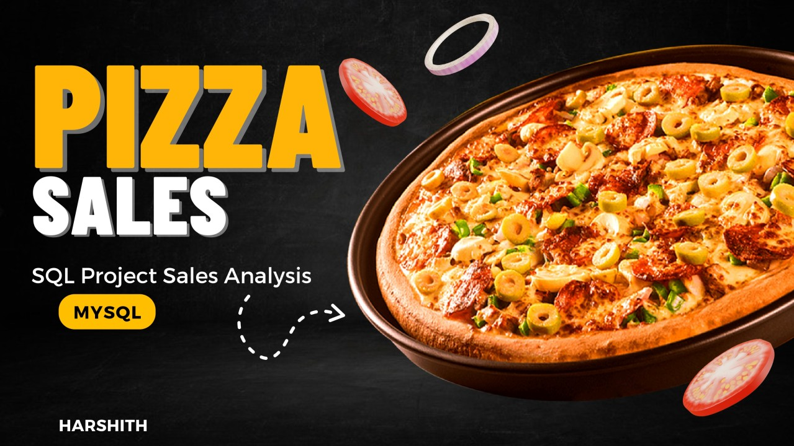

# Pizza_Sales_Analysis_Using_Sql
Project Overview
This project explores a pizza sales database to answer a set of questions that help understand the operational performance, product trends, customer behavior, and revenue insights for a pizza business. Using SQL, the project analyzes various aspects of the data to derive meaningful conclusions that can guide business decisions.

  

Understanding the Database
 The database used for this project is pizza_sales_database, consisting of four tables:-
1. pizzas: Contains information about different pizza types and their characteristics.
2. pizza_type: Contains details about various categories of pizzas.
3. orders: Holds data on customer orders, including order times and sizes.
4. order_details: Provides information on the specifics of each order, such as the pizza ordered and the quantity.

## Questions
# Basic:
Retrieve the total number of orders placed.
Calculate the total revenue generated from pizza sales.
Identify the highest-priced pizza.
Identify the most common pizza size ordered.
List the top 5 most ordered pizza types along with their quantities.
# Intermediate:
Join the necessary tables to find the total quantity of each pizza category ordered.
Determine the distribution of orders by hour of the day.
Join relevant tables to find the category-wise distribution of pizzas.
Group the orders by date and calculate the average number of pizzas ordered per day.
Determine the top 3 most ordered pizza types based on revenue.
# Advanced:
Calculate the percentage contribution of each pizza type to total revenue.
Analyze the cumulative revenue generated over time.
Determine the top 3 most ordered pizza types based on revenue for each pizza category.
## Conclusions
Based on our Pizza Sales Analysis project, we've drawn several key insights about sales trends, customer behavior, and revenue distribution:

# Total Orders and Revenue: The total number of orders placed is 21,350, resulting in a total revenue of ₹827,450. This indicates a robust customer base and consistent sales performance.

# Highest-Priced Pizza: The Greek Pizza, priced at ₹36, is the most expensive item on the menu, suggesting a premium offering for customers seeking unique flavors.

# Popular Pizza Size: The most common pizza size ordered is size L, with 18,526 orders. This indicates a preference for larger pizzas, which might be due to families or groups frequently ordering.

# Top 5 Most Ordered Pizza Types: The top 5 most ordered pizza types, with their respective order counts, are:

Classic Deluxe pizzas (2,453 orders)
Barbecue Chicken pizza (2,432 orders)
Hawaiian pizza (2,422 orders)
Pepperoni pizza (2,418 orders)
Thai Chicken pizza (2,371 orders)
Popular Pizza Categories: The most ordered pizza categories are Classic and Supreme, showing a trend towards traditional and specialty pizzas.

Peak Ordering Times: The peak hours for orders are from 16:00 to 19:00, indicating that customers mostly order during the late afternoon and early evening. The least busy times are around 09:00 and 10:00.

# Top 3 Most Ordered Pizza Types Based on Revenue:

The Thai Chicken pizza leads in revenue contribution with 44,027 orders.
Barbecue Chicken pizza follows closely with 43,376 orders.
California Chicken pizza comes third with 42,002 orders.
Revenue Contribution by Pizza Type:

# Classic pizzas contribute 26.96% to total revenue.
Supreme pizzas contribute 25.51%.
Chicken pizzas contribute 24.01%.
Veggie pizzas contribute 23.53%.
These insights can guide strategic decisions in pizza business operations, allowing for a more targeted approach to marketing, product development, and customer engagement.
